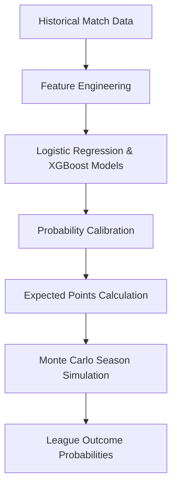
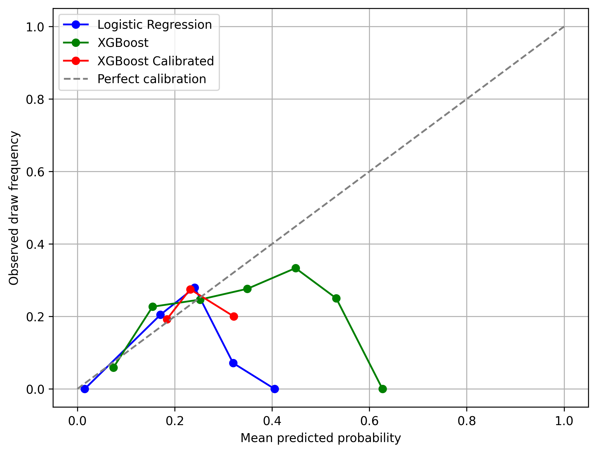
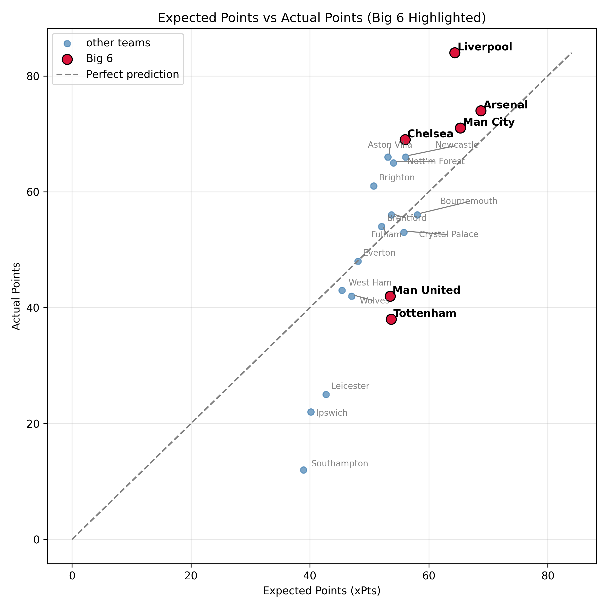

# Premier League Match Outcome Prediction & Season Simulation

A **probabilistic machine learning project** that predicts Premier League match outcomes with an explicit focus on **draw modeling** and **uncertainty quantification**.

Instead of hard win/loss predictions, the models output **calibrated probabilities** for **Home / Draw / Away** outcomes. These probabilities are then used to compute **expected points (xPts)** and run **Monte Carlo season simulations**, translating match-level uncertainty into league-level insights.

---

## Why This Project?

Football outcomes are inherently noisy, and **draws are systematically under-modeled** in most prediction systems. Accuracy-focused models often appear strong while producing poorly calibrated probabilities, limiting their usefulness for simulation, forecasting, and decision-making.

This project addresses that gap by:
- Treating outcome prediction as a **probability estimation problem**
- Explicitly modeling draws and class imbalance
- Evaluating models on **calibration and uncertainty**, not just accuracy
- Propagating uncertainty through full-season simulations

---

## Tech Stack

- Python
- Pandas
- NumPy
- Scikit-learn
- XGBoost
- Matplotlib / Seaborn
- Streamlit

---

## Modeling Pipeline



---

## Data

**Source:** Historical Premier League match data (Kaggle)

The dataset used in this project is included in the repository under `data/raw/`.

Dataset size:
- ~380 matches per season
- Multiple seasons of historical match results

### Raw Match Data
The raw dataset contains match-level outcomes including:
- Home team
- Away team
- Goals scored
- Match outcome (Home / Draw / Away)

### Engineered Features
Additional modeling features are generated during feature engineering, including:
- Home & away team form (rolling windows)
- Goals scored / conceded trends
- Goal difference statistics
- Points-per-game differentials
- Match-level contextual features

All data splits are **strictly chronological** to mirror real-world forecasting and avoid information leakage.

---

## Modeling Approach

### Models
- **Logistic Regression** (probabilistic baseline)
- **XGBoost Classifier**
  - Class-weighted to improve draw sensitivity
  - Outputs full probability distributions

### Techniques
- Class imbalance handling
- Temporal train / calibration / evaluation splits
- Multiclass probability calibration
- Draw-aware evaluation

---

## Probability Calibration

Because downstream analyses rely directly on probabilities, calibration is critical.

**Strategy**
- Sigmoid (Platt) calibration  
- Separate temporal calibration split (no overlap with training or testing)
- Multiclass calibration with draw-specific analysis

**Evaluation**
- Reliability curves (draw-focused)
- Expected Calibration Error (overall + draw class)
- Brier score (pre- vs post-calibration)

---

## Evaluation Metrics

Evaluation prioritizes **probabilistic quality** over raw accuracy.
Accuracy is reported for completeness, but model selection is driven primarily by probabilistic quality (log loss, calibration, and draw recall).


| Model                  | Accuracy | Log Loss | Draw Recall |
|------------------------|----------|----------|-------------|
| Baseline (Always Home) | 0.41     | 21.34    | 0.0        |
| Logistic Regression    | 0.49     | 1.01     | 0.0        |
| XGBoost                | 0.47     | 1.04     | 0.19        |
| **XGBoost (Calibrated)** | **0.48** | **1.02** | **0.09** |

---

## Key Results

### Draw Calibration Comparison


### Expected vs Actual Points


---

## Expected Points (xPts)

Match probabilities are converted into **expected points**:

- Home: `3 × P(Home) + 1 × P(Draw)`
- Away: `3 × P(Away) + 1 × P(Draw)`

Aggregating xPts across the season produces an **expected league table**, enabling comparison with actual outcomes to identify over- and under-performance.
Expected points reduce variance from single-match randomness, providing a more stable estimate of team strength than realized outcomes.

---

## Monte Carlo Season Simulation

Using calibrated probabilities, **10,000 full-season simulations** are run.
This translates match-level uncertainty into season-level risk, enabling probabilistic forecasts such as “Top-4 probability” rather than deterministic rankings.

Each simulation estimates:
- Expected season points
- Points uncertainty (standard deviation)
- Title, top-4, and relegation probabilities
- 5th–95th percentile confidence intervals

---

## Results & Visualizations

See 02_pl_summary.ipynb for:
- Draw-focused reliability curves
- Expected vs actual points scatter plots
- Season points distributions
- Big-6 confidence intervals
- Monte Carlo outcome probabilities

All figures are stored in `reports/figures/`.

---

## Project Structure

```
premier-league-ml/
│
├── data/
│   ├── raw/                         # Original immutable data
│   │   └── PremierLeague.csv
│   └── processed/                   # Cleaned / feature-engineered data
│       ├── PL_processed.csv
│       └── features_v1.csv
│
├── notebooks/                       # Exploration and analysis
│   ├── 01_data_sanity.ipynb
│   └── 02_pl_summary.ipynb
│
├── src/                             # Core project code
│   ├── data_prep.py
│   ├── features.py
│   ├── train.py
│   ├── evaluate.py
│   ├── monte_carlo.py
│   └── league_table.py
│
├── reports/                         # Generated analysis outputs
│   ├── figures/
│   │   ├── big_6_season_points_ci.png
│   │   ├── big_6_season_points_histograms.png
│   │   ├── reliability_curve_draws_comparison.png
│   │   └── xpts_vs_actual_scatter.png
│   │
│   ├── tables/
│   │   ├── league_table_expected_vs_actual.csv
│   │   ├── league_table_monte_carlo_comparison.csv
│   │   ├── match_probabilities_xgb_calibrated.csv
│   │   ├── monte_carlo_season_simulations.csv
│   │   ├── monte_carlo_season_summary.csv
│   │   └── model_metrics_summary.csv
│   │
│   └── plots/
│       └── xpts_vs_actual_scatter.py
│
├── requirements.txt
└── README.md

```

---

## Key Takeaways

- Calibrated probabilities significantly improve draw modeling
- Expected points provide a more stable performance measure than actual results
- Monte Carlo simulations highlight uncertainty and volatility even among top teams

---

## Future Improvements

Potential extensions to improve realism and predictive performance:

- Combined home & away team form representations
- Player-level features
- xG / xA chance creation metrics
- Bayesian hierarchical models
- Multi-season validation and backtesting

---

## License

This project is for educational and research purposes.

---

## Setup
1. Install dependencies

pip install -r requirements.txt

2. Run training pipeline

python src/train.py


